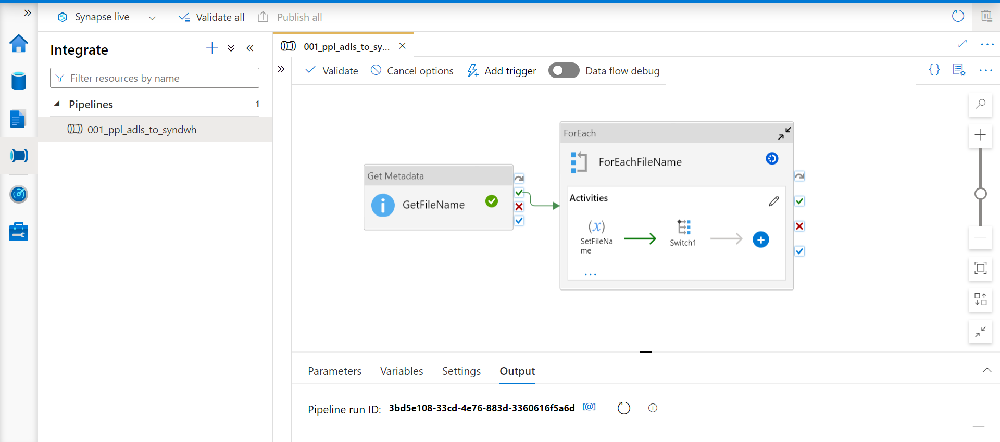
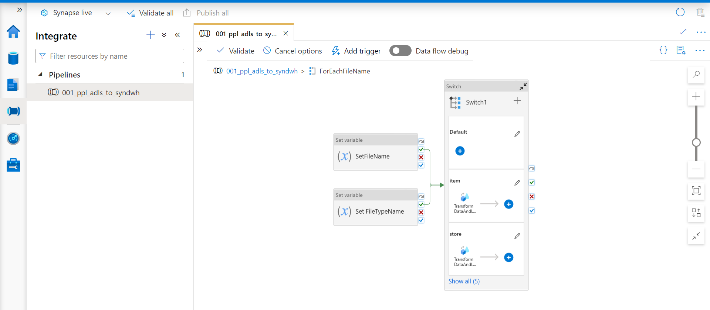

# Build-ETL-Pipeline-in-Azure-with-Azure-Synapse-Analytics
ETL (Extract, Transform and Load) E-Commerce Data using Azure Data Factory (ADF) and Azure Synapse Analytics

## Description
The aim of this project, is to  Extract the data from the Azure Data Lake Storage and transform data in Azure Data Factory and load it into the Synapse DWH using Dedicated SQL Pool. Additionally Creating a Dimensional Data Modelling and visualizing it through PowerBI

## Getting Started

## Architecture Diagram

## Data Pipeline (Loop Items using GetMetaData Activity)

## Data Pipeline 

## Data Pipeline (Data Flow) 

## Data Pipeline (Transformation) 

## Dataset
- Retail Dataset ( https://docs.microsoft.com/en-us/power-bi/sample-retail-analysis )

## Services
- Azure Data Factory
- Azure Data Lake Storage
- Azure Synapse Analytics
- PowerBI

## Language
- SQL

## Data Formats
- csv

